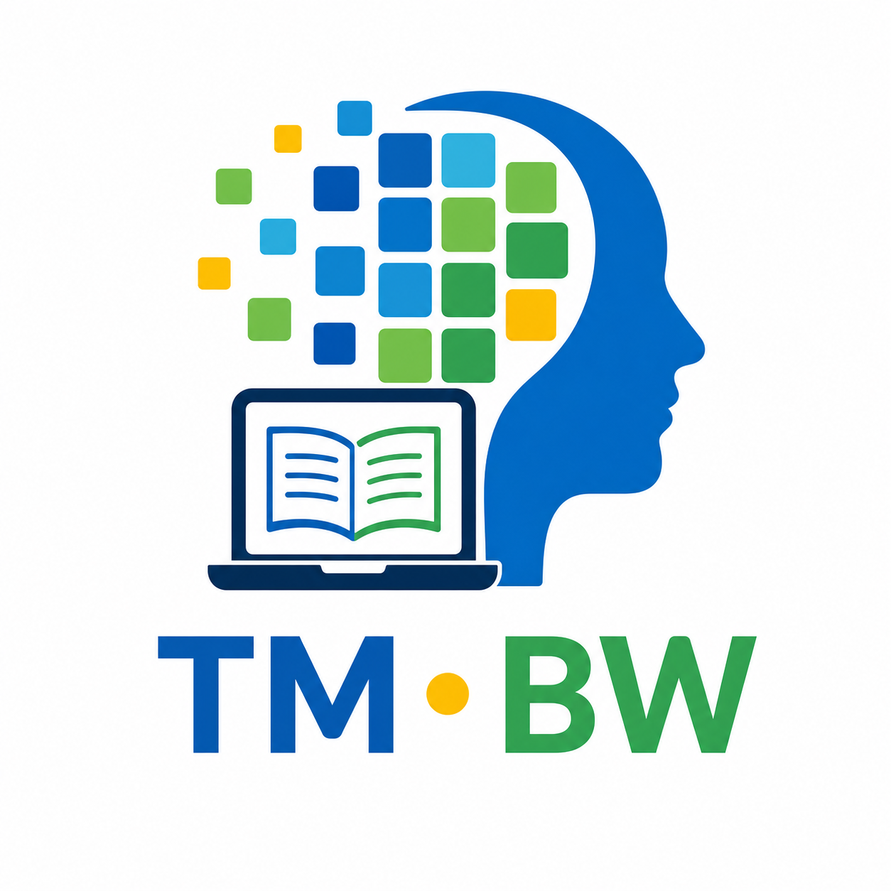

# Teachable Machine im Unterricht (BW 2016)

[]()
[]()
[]()
[]()

Dieses Repository bündelt Materialien zu **Teachable Machine** für den Unterricht in der **Sekundarstufe I in Baden-Württemberg** mit Bezug auf den **Bildungsplan 2016**.  
Der Fokus liegt auf einem schnellen Einstieg, klaren Unterrichtsmaterialien und einer direkt nutzbaren GitHub-Pages-Struktur.



## Ziel des Repositories

Dieses Projekt unterstützt Lehrkräfte dabei, KI-Themen niedrigschwellig in den Unterricht zu integrieren:

- praxisnaher Einstieg in maschinelles Lernen ohne Programmierhürde
- klare Trennung zwischen Material für Lehrkräfte und Schüler:innen
- sofort einsatzfähige Struktur für Unterricht, Präsentation und Dokumentation
- gute Basis für OER-Nutzung und Weiterentwicklung

## Schnellstart

1. Repository klonen oder als ZIP herunterladen.
2. Lokalen Server starten:

   ```bash
   python -m http.server 8000
   ```

3. Im Browser öffnen: `http://localhost:8000/`
4. Startseite nutzen (`index.html`) und passende Materialien in `docs/` auswählen.

## Repository-Struktur (Dateiübersicht)

### Root

- `README.md` – Projektüberblick, Einstieg und Struktur
- `INSTALL.md` – technische Einrichtung, lokales Testen und Pages-Hinweise
- `index.html` – moderne Startseite für GitHub Pages
- `index.md` – kompakte Markdown-Startseite mit Materiallinks
- `logo_TM.png` – primäres Projektlogo (im README eingebunden)
- `LICENSE` – Lizenzinformationen

### Ordner

- `docs/` – didaktische Kernmaterialien
  - `teacher_guide.md` – Leitfaden für Lehrkräfte
  - `student_guide.md` – Arbeitsanleitung für Schüler:innen
  - `lesson_plan.md` – allgemein formuliertes Unterrichtsvorhaben (Sek I)
- `examples/` – Platzhalter für konkrete Modell-/Projektbeispiele
  - `image-project/README.md` – Hinweise für Bildmodell-Beispiele
  - `audio-project/README.md` – Hinweise für Audiomodell-Beispiele
  - `pose-project/README.md` – Hinweise für Pose-Modell-Beispiele
- `assets/` – zusätzliche Medien/Assets (z. B. `logo.svg`)

## So arbeitest du mit den Materialien

1. **Planung:** `docs/teacher_guide.md` als didaktische Grundlage lesen.
2. **Durchführung:** `docs/student_guide.md` als Lernpfad für die Klasse einsetzen.
3. **Unterrichtsrahmen:** `docs/lesson_plan.md` für Sequenzplanung und Kompetenzbezug nutzen.
4. **Praxisbeispiele:** Eigene Modell-Exports in `examples/` ablegen und dokumentieren.

## Teachable-Machine-Modelle einbinden

- Modelle in Teachable Machine trainieren und exportieren.
- Exportdateien projektbezogen in einen Unterordner von `examples/` legen.
- Eine eigene Testseite erstellen oder bestehende Seiten erweitern, um das Modell im Browser zu demonstrieren.


## Hinweise für den Unterricht

- Für den Start reichen Browser, Internetzugang und Webcam (optional Mikrofon).
- Sinnvolle Schwerpunkte: Datenqualität, Modellgrenzen, Fehlklassifikationen, Bias/Fairness.
- Das Repo kann als Materialsammlung, Projektdokumentation oder Ausgangspunkt für eine schulische OER-Instanz genutzt werden.
